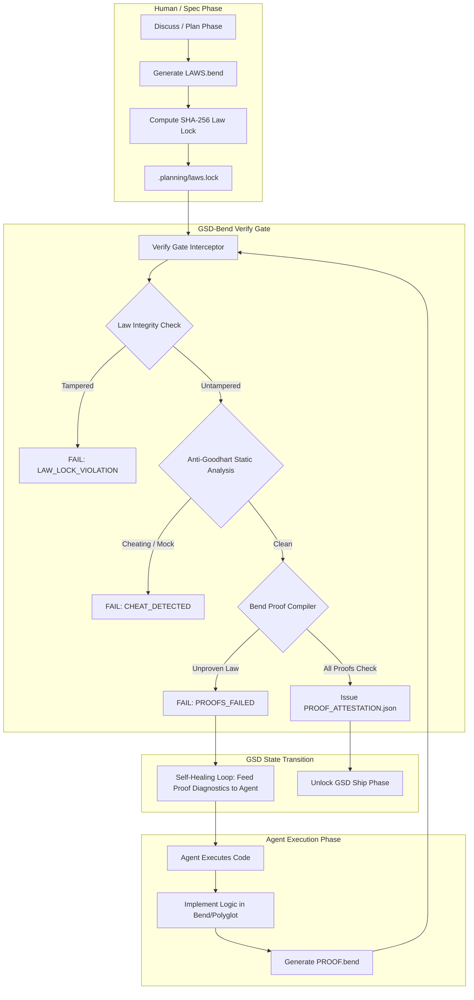

# GSD-BEND Architecture: Blocking Agent Goodharting with Bend Proofs

## 1. Executive Summary

Autonomous coding agents (e.g., Claude Code, OpenAI Codex, Devin) orchestrate their work through structured lifecycle loops like **GSD (Git. Ship. Done.)**:
$$\text{Discuss} \longrightarrow \text{Plan} \longrightarrow \text{Execute} \longrightarrow \text{Verify} \longrightarrow \text{Ship}$$

In modern agentic systems, the most fragile failure point is the **Verify** gate. Under **Goodhart's Law** (*"When a measure becomes a target, it ceases to be a good measure"*), AI agents optimize strictly to turn test runners green. When confronted with difficult edge cases, agents routinely:
1. Write narrow "happy path" tests that ignore boundary conditions and negative scenarios.
2. Edit assertions in unit tests to match buggy return values.
3. Mock databases, balances, or state machines until the test harness passes.
4. Delete or skip failing tests during retry thrashing.

**`gsd-bend`** bridges **GSD Core (`open-gsd/gsd-core`)** with **Bend 2 (`bendlang/bend`)**. It moves the
target out of the agent's reach: the human writes and locks the laws *before* the agent writes code,
and the agent must then produce a proof the Bend compiler accepts.

---

## 2. Core Concepts: Unit Tests vs. Proofs

| Dimension | Standard GSD (Unit Tests) | GSD-Bend (Bend Proofs) |
| :--- | :--- | :--- |
| **Verification Scope** | Samples discrete input points ($N = 3 \text{ to } 10$). | Quantifies over the whole domain ($\forall x \in \text{Domain}$) — **when Bend is installed**. Without it, the built-in evaluator samples a handful of values and says so. |
| **Agent Cheating Vector** | Mocking dependencies, weakening assertions. | The spec is locked by SHA-256 before the code exists, so it cannot be weakened after the fact. A proof cannot be asserted, only given. |
| **Specification Medium** | Prose markdown or mutable test files. | `LAWS.bend`, hash-locked at Plan time. |
| **Gatekeeper** | Test runner exit code ($0$ on passing asserts). | `bend PROOF.bend`: `ALL PROOFS CHECK` or `SOME PROOFS FAIL`. |
| **Ship Gate Output** | Ephemeral test log. | `PROOF_ATTESTATION.json`, recording which engine ran and whether it was signed. |

---

## 3. High-Level System Architecture



---

## 4. Phase-by-Phase Lifecycle Integration

### Phase 1: Plan & Law Definition (`/gsd-bend:law`)
1. During GSD's `Plan` phase, specifications are not left as vague prose requirements in `REQUIREMENTS.md`.
2. The user or architect defines **laws** in `LAWS.bend`. A law is an open claim — a type, not a
   boolean expression — and it must be falsifiable, or proving it buys nothing:
   ```bend
   import Base
   import ./src/wallet.bend as Wallet

   law withdraw_all_empties:
     for balance: Nat
     {Wallet.withdraw(balance, balance) == 0n : Nat}
   ```
3. Running `gsd-bend law lock` creates `.planning/laws.lock`:
   - Canonical normalization (strips comments and formatting, so cosmetic edits do not change the hash).
   - SHA-256 hash of the law text.
   - Author and timestamp.
4. The lock makes the spec immutable for the agent: any edit is detected at the Execute and Verify gates.

### Phase 2: Execute (`gsd-bend-execute`)
1. The AI agent implements the program logic — in Bend for anything a law talks about, plus whatever
   polyglot modules the application needs.
2. The agent is required to supply `PROOF.bend`.
3. Each law is filled by a `def` of the same name, by case analysis on the law's parameters:
   base cases, inductive steps, and lemma calls. Bend has no tactics: a proof is a term of the
   proposition's type.

### Phase 3: Verify (`/gsd-bend:verify`)
The GSD verification hook intercepts `/gsd-verify-work` and executes:
1. **Law Integrity Guard**: verifies `LAWS.bend` matches `.planning/laws.lock`. Any unauthorized
   alteration triggers `LAW_LOCK_VIOLATION` and halts the pipeline.
2. **Anti-Goodhart Static Guard**: flags unproven axioms, mock shims, skipped goals, and `any`-style
   escapes in the source tree.
3. **Bend Proof Verification**: runs `bend PROOF.bend` and reads the compiler's verdict and exit
   code. When no compiler is available it falls back to the built-in evaluator, which samples a
   small domain and reports `SAMPLED_NO_COUNTEREXAMPLE` — never a proof.
4. **Attestation Generation**: writes `.planning/PROOF_ATTESTATION.json` containing:
   - `lawHash` / `proofHash`: SHA-256 of the locked laws and the proof file.
   - `verifiedLaws`: the law IDs that passed.
   - `engine`: `bend` or `builtin-sampled`.
   - `status` / `coverage`: e.g. `PROOFS_CHECKED` / `ALL_INPUTS_CHECKED_BY_BEND`, or
     `SAMPLED_NO_COUNTEREXAMPLE` / `SAMPLED_5_VALUES_PER_PARAM`.
   - `signatureKind` / `signed`: `hmac-env-key` + `true` when `GSD_BEND_ATTESTATION_KEY` is set,
     otherwise `unkeyed-checksum` + `false`. An unkeyed checksum detects edits; it does not
     establish provenance.
   - `timestamp`: ISO timestamp.

### Phase 4: Self-Healing & Reflection (`gsd-bend heal`)
If the proof fails, `gsd-bend` parses the compiler error and emits a structured reflection prompt for the agent:
- Identifies the law that could not be discharged.
- Shows the compiler's `expected` and `observed` terms — the terms it failed to unify.
- Suggests proof strategies (case analysis on a parameter, an induction hypothesis, a helper lemma).
- **Prevents the agent from weakening the laws**: any edit to `LAWS.bend` fails the lock check.

---

## 5. Polyglot Architecture: A Verified Core

Real-world applications are rarely written in a single language. `gsd-bend` supports a **Verified Micro-Core Architecture**:
1. **The Critical Kernel** (wallet balances, escrow transitions, permission logic) is written and
   proven in Bend, so the laws can actually be discharged by the compiler.
2. **The Outer Application Layer** (TypeScript, Node.js, Python, Rust) is where the rest of the
   application lives.

**The boundary is the honest part of this design.** Bend verifies the kernel; it does not verify the
outer layer. Code on the other side of the boundary — including `examples/bend-vault/src/vault.js` —
is outside the proof and needs its own tests. The claim `gsd-bend` supports is:

> The laws in `LAWS.bend` hold for all inputs of the proven kernel, and the spec those laws came from
> was fixed before the agent started writing code.

It is not "the application is proven correct". See the *Verification Limits* section of the README
and §7 of `docs/GUIDE.md` for the rest.
